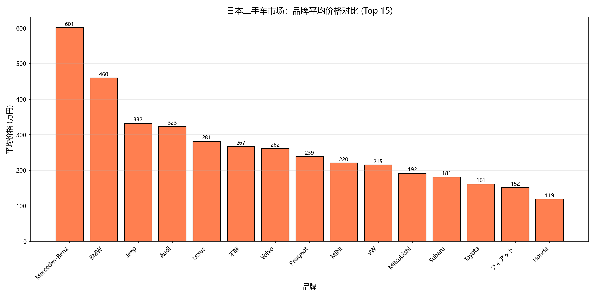
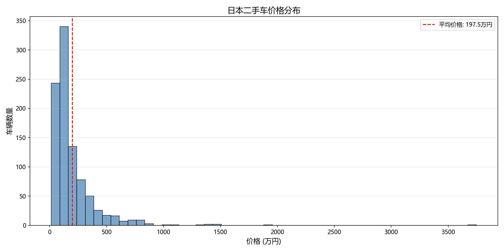
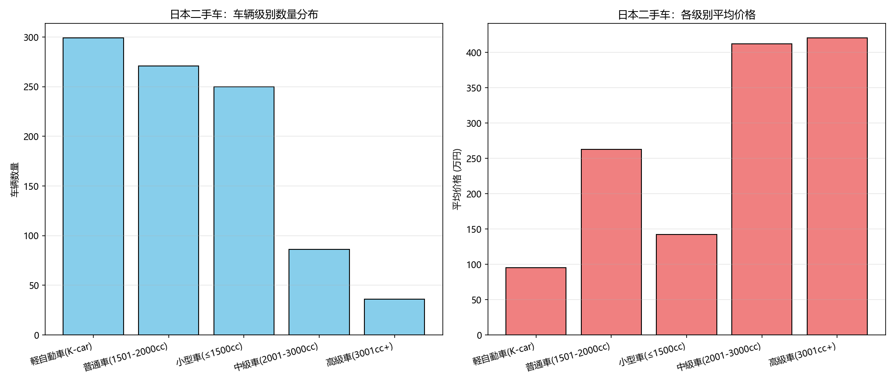
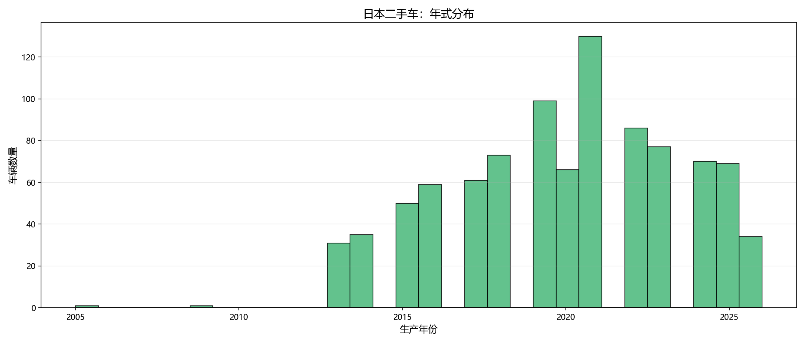

# 🇯🇵 日本汽车市场智能分析系统

> 基于 [德国汽车市场智能分析系统](https://github.com/Zephyr-Song/japan-car-market) 的方法论，复刻到日本二手车市场

[](https://www.carsensor.net/usedcar/)
[]()
[]()

## 📊 数据概览

| 指标 | 数值 |
|------|------|
| 采集数据量 | 942 台车 |
| 覆盖品牌 | 19 个 |
| 价格范围 | 14.6 ~ 3,748 万円 |
| 平均价格 | 197.5 万円 |
| 年式范围 | 2005 - 2026 |

## 📈 可视化分析

### 品牌平均价格对比


### 价格分布


### 车辆级别分析


### 年式分布


## 🇯🇵 日本市场特色发现

### K-car 现象
**軽自動車 (K-car)** 是日本独有的市场分类——排量 ≤660cc，享受减税优惠：
- 占日本二手车市场 **31.7%**
- 均价仅 **95.5 万円**（约 ¥4,600）
- 以 Honda N-BOX、Suzuki ハスラー、Daihatsu ミライース 为代表

### 品牌价格金字塔
| 梯队 | 品牌 | 均价(万円) |
|------|------|-----------|
| 🏆 豪华进口 | Mercedes-Benz | 600.8 |
| 🏅 进口高端 | BMW / Jeep / Audi | 330-460 |
| 🥉 准豪华 | Lexus / Volvo / MINI | 220-280 |
| ⚡ 国民品牌 | Toyota / Honda / Nissan | 116-161 |
| 💰 经济品牌 | Suzuki / Daihatsu / Mazda | 78-98 |

### 地域差异
- **東京都** 均价最高 (580.3万円) —— 豪车经销商集中地
- **愛知県** 数据量最多 (113台) —— 丰田总部所在地
- **大阪府** 数据量第二 (87台) —— 关西经济中心

## 🔧 技术栈

```
Playwright (爬虫) → Pandas (清洗) → SQLite (存储) → Prophet (预测) → Streamlit (Dashboard)
```

| 模块 | 说明 |
|------|------|
| `src/crawler.py` | Playwright 爬虫，按10个分类采集 carsensor.net |
| `src/process.py` | 数据清洗：年号→西元、K-car分类、品牌英文映射 |
| `src/analyze.py` | 统计分析 + matplotlib 可视化 |
| `src/forecast.py` | Prophet 趋势预测 |
| `src/dashboard.py` | Streamlit 交互式 Dashboard |

## 🚀 快速开始

### 1. 安装依赖
```bash
pip install -r requirements.txt
playwright install chromium
```

### 2. 数据采集
```bash
python src/crawler.py
```

### 3. 数据清洗 & 分析
```bash
python src/process.py
python src/analyze.py
```

### 4. 启动 Dashboard
```bash
streamlit run src/dashboard.py
```

## 📂 项目结构

```
japan-car-market/
├── README.md
├── requirements.txt
├── .gitignore
├── src/
│   ├── crawler.py          # Playwright 爬虫
│   ├── process.py          # 数据清洗
│   ├── analyze.py          # 分析 + 可视化
│   ├── forecast.py         # Prophet 趋势预测
│   ├── dashboard.py        # Streamlit Dashboard
│   ├── debug_dom.py        # DOM 调试工具
│   └── debug_brands.py     # 品牌URL调试
└── data/
    └── analysis/
        ├── price_distribution.png
        ├── brand_avg_price.png
        ├── vehicle_class_analysis.png
        └── year_distribution.png
```

## 🇩🇪 vs 🇯🇵 与德国系统对照

| 功能 | 🇩🇪 德国系统 | 🇯🇵 日本系统 |
|------|------------|------------|
| 数据源 | AutoScout24 | carsensor.net |
| 价格单位 | € | 万円 |
| 特色分类 | 燃料类型 | K-car / 車両級別 |
| 地区维度 | 联邦州 | 都道府县 |
| 懒加载问题 | 无 | document.write 污染 |

## ⚠️ 已知局限

- 标价非成交价（日本二手车通常有议价空间）
- 单次采集数据量有限（~1000台），建议多日持续采集
- 反爬机制：请求过快会被限流/超时
- Prophet 预测需持续采集才能生成有效趋势

## 📄 License

MIT
