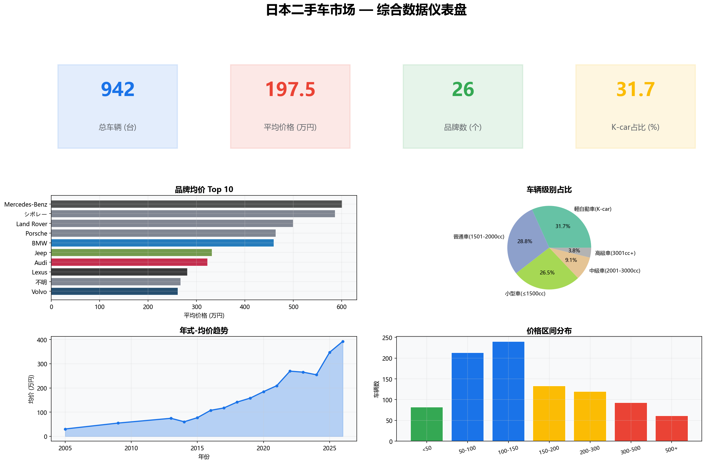
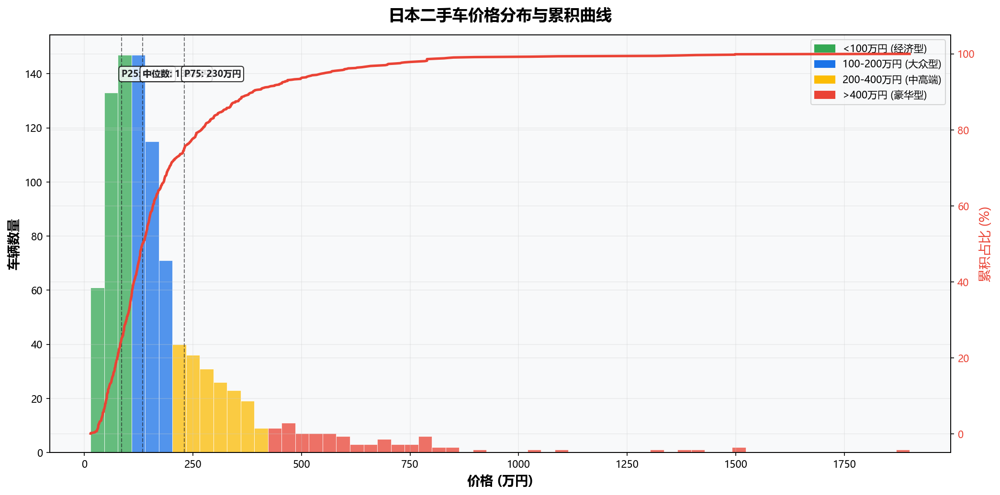
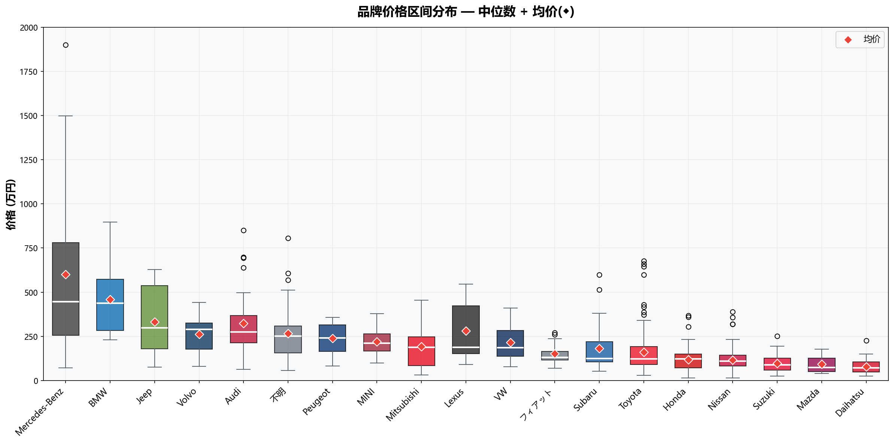
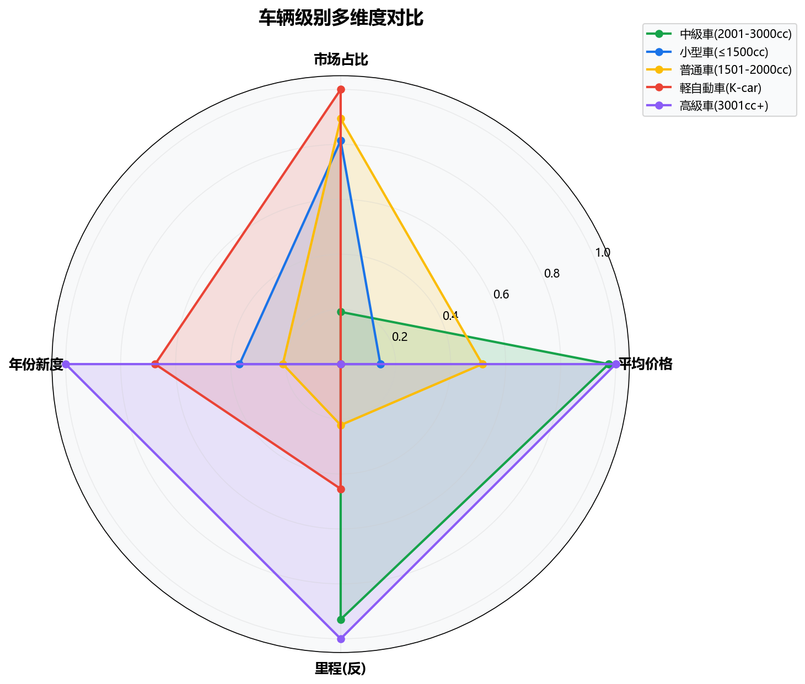
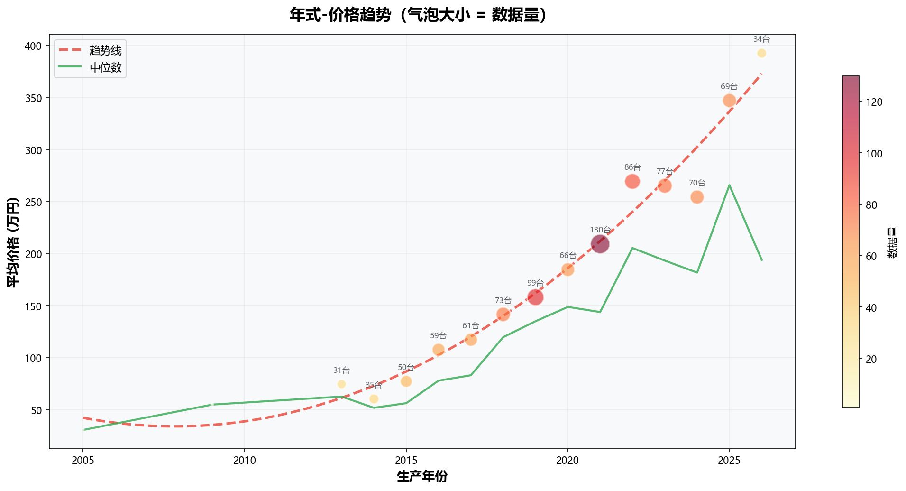
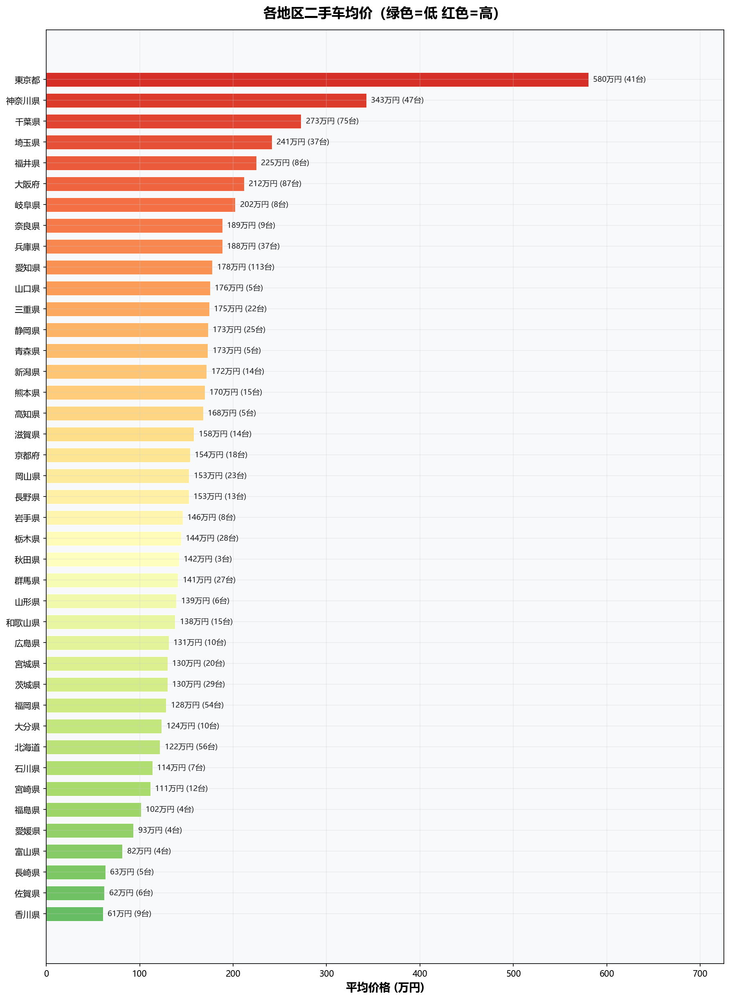
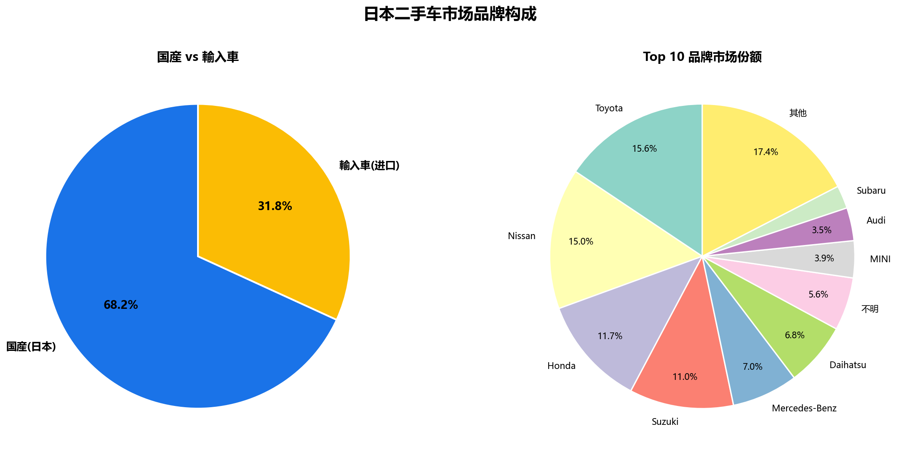

# 🇯🇵 日本汽车市场智能分析系统
# Japan Automobile Market Intelligence Platform

[](https://www.carsensor.net/usedcar/)
[](https://www.goo-net.com/usedcar/)
[]()
[]()
[]()
[]()

> 实时监控日本二手车市场价格、品牌分布与宏观市场趋势
>
> **数据更新：二手车 ~每日 / 新车月度统计 自动刷新**

---

## 📊 项目概览

本项目整合 **二手车实时挂牌数据** + **新车注册统计** + **K-car 细分市场**三大数据源，构建完整的日本汽车市场分析体系。

### 核心数据规模

| 数据源 | 表名 | 记录数 | 时间范围 |
|--------|------|--------|---------|
| 🚗 二手车挂牌 | `used_cars_cleaned` | **1,113 台** | 2005~2026 式（2026-06-28 抓取） |
| 📈 品牌别新车注册 | `new_car_sales_brand` | **3,909 条** | 2022-01 ~ 2026-05 |
| 🏍️ K-car 月度销量 | `kcar_monthly_sales` | **372 条** | 1996-01 ~ 2026-12 |
| 🏆 K-car 品牌份额 | `kcar_brand_sales` | **8 条** | 2026-05 |
| 📉 市场月度汇总 | `japan_monthly_summary` | **365 条** | 1996-01 ~ 2026-05 |

### 二手车数据维度

| 指标 | 数值 |
|------|------|
| 覆盖品牌 | **26 个**（国产 17 + 进口 9） |
| 覆盖地区 | **44 个** 都道府县 |
| 价格区间 | **12.2 ~ 3,748 万日元** |
| 平均价格 | **188.6 万日元**（约 ¥8.6 万） |
| K-car 占比 | **32.3%**（360 台） |
| 数据来源 | [Carsensor.net](https://www.carsensor.net/usedcar/) 日本最大二手车平台 |

---

## 🗂️ 项目结构

```
japan-car-market/
├── README.md                          ← 你在这里
├── requirements.txt                   ← Python 依赖
├── .gitignore
│
├── data/
│   ├── japan_car_market.db            ← SQLite 主数据库（~4MB）
│   ├── used_cars_cleaned.csv          ← 二手车清洗后数据
│   ├── new_car_sales_brand.csv        ← JADA 品牌别注册量
│   ├── kcar_monthly_sales.csv        ← K-car 月度细分
│   ├── kcar_brand_sales.csv          ← K-car 品牌份额
│   ├── japan_monthly_summary.csv     ← 市场月度汇总
│   └── analysis/                     ← 可视化图表
│       ├── 01_price_distribution.png
│       ├── 02_brand_price_range.png
│       ├── 03_vehicle_class_radar.png
│       ├── 04_year_price_trend.png
│       ├── 05_prefecture_heatmap.png
│       ├── 06_brand_market_share.png
│       └── 07_dashboard_overview.png
│
└── src/
    ├── crawler.py                     ← Playwright 爬虫（carsensor.net）
    ├── process.py                    ← 数据清洗（JIS 日车牌号/年号转换）
    ├── macro_data_crawler.py         ← 宏观数据采集（JADA / 全軽自協）
    ├── analyze.py                    ← 静态可视化（7 张图表）
    ├── forecast.py                   ← Prophet 时间序列预测
    ├── dashboard.py                  ← Streamlit 交互仪表盘
    ├── refresh_data.py               ← 数据刷新入口（cron 调度）
    └── quality_report.py             ← 数据质量报告
```

---

## 🇯🇵 日本汽车市场关键洞察

### 1. K-car —— 全球独一无二的细分市场

**軽自動車（K-car）** 是日本独有的汽车分类，享受大幅税费减免和停车优惠，无需提交停车证明（城市购车最大门槛）。

| K-car 指标 | 数值 |
|-----------|------|
| 新车销量占比 | **40%+**（日本新车市场约四成） |
| 二手车数据占比 | **32.3%**（360/1,113 台） |
| 代表车型 | Honda N-BOX、Suzuki ハスラー、Daihatsu ミライース |
| 税费优势 | 车税 ~¥7,200/年 vs 普通车 ¥¥25,000+ |

### 2. 品牌价格金字塔

| 梯队 | 代表品牌 | 均价（万円） | 特征 |
|------|---------|------------|------|
| 🏆 豪华进口 | Mercedes-Benz | ~600 | G63 单车 3,748 万円，品牌溢价最高 |
| 🏅 高端进口 | BMW / Jeep / Audi | 330~460 | 德系三强 + 美系越野 |
| 🥉 准豪华 | Lexus / Volvo / MINI | 220~280 | 日系豪华 + 欧洲精品 |
| ⚡ 国民品牌 | Toyota / Honda / Nissan | 116~161 | 市场主力，数据量最大（合计 484 台） |
| 💰 经济品牌 | Suzuki / Mazda / Daihatsu | 78~98 | K-car 和小型车主导 |

### 3. 日本年号与折旧规律

日本二手车使用**和暦（年号）**标注年份，需转换为西元：

| 年号 | 西元 | 典型在售车龄 |
|------|------|------------|
| 令和元年 | 2019 | 7 年（主力在售） |
| 平成 28 年 | 2016 | 10 年（K-car 主力） |
| 平成 25 年 | 2013 | 13 年（经济型） |
| 昭和 63 年 | 1988 | 38 年（经典老车） |

**折旧规律：**
- 前 5 年：年折旧 ~7%，折旧最陡
- 5~10 年：年折旧 ~4%，趋于平缓
- 10 年以上：年折旧 ~2~3%
- **K-car 最保值**：15 年车龄仍可售 30~50 万日元

### 4. 2026 年日本新车市场

2026 年 5 月 JADA 数据：
- **注册车（乘用车）**：330,060 台
- K-car 份额：~31.7%
- Toyota / Honda / Nissan 三强合计占比 ~60%

---

## 📈 可视化分析

### 综合仪表盘


### 价格分布


### 品牌价格区间


### 车辆级别雷达图


### 年式趋势


### 地区热力图


### 品牌份额


---

## 🔧 技术架构

```
┌─────────────────────────────────────────────────────────────┐
│                    数据采集层                                 │
├─────────────────────────────────────────────────────────────┤
│  🚗 二手车爬虫          │  📈 宏观数据爬虫                    │
│  Playwright + carsensor │  JADA 全軽自協 MarkLines           │
│  每日自动刷新           │  每月自动同步                       │
├─────────────────────────────────────────────────────────────┤
│                    数据存储层                                 │
│              SQLite  →  japan_car_market.db                  │
├─────────────────────────────────────────────────────────────┤
│                    分析引擎层                                 │
│  Pandas（清洗/分析） + Plotly（可视化） + Prophet（预测）     │
├─────────────────────────────────────────────────────────────┤
│                    应用层                                     │
│       Streamlit Dashboard（交互分析） + 静态图表（报告）        │
└─────────────────────────────────────────────────────────────┘
```

### 爬虫关键技术挑战与解决方案

| 挑战 | 解决方案 |
|------|---------|
| 图片懒加载 `document.write` 污染链接文本 | 从 `` 提取真实车型名 |
| 非标准分页 URL | 使用 `index2.html` 分页格式 |
| 日本年号（令和/平成/昭和）→ 西元 | 本地年号映射表精确转换 |
| 品牌名称日语→英语 | 维护品牌映射字典（トヨタ→Toyota 等）|
| 数据源分散 | 按国产/进口/K-car/SUV/MPV 等分类分别采集 |
| 反爬限流 | 每页随机延迟 2~5 秒 |

---

## 🚀 快速开始

### 环境安装

```bash
pip install -r requirements.txt
playwright install chromium
```

### 数据采集

```bash
# 采集二手车数据（需网络访问 carsensor.net）
python src/crawler.py

# 采集宏观数据（JADA + 全軽自協，无需登录）
python src/macro_data_crawler.py
```

### 数据清洗

```bash
# 清洗并入库
python src/process.py
```

### 可视化分析

```bash
# 生成 7 张静态图表
python src/analyze.py

# 生成 Prophet 趋势预测
python src/forecast.py
```

### 交互式仪表盘

```bash
streamlit run src/dashboard.py
```

仪表盘功能模块：
- 💰 **价格分析** — 直方图 + 区间统计 + CDF 累积曲线
- 🏭 **品牌分析** — 箱线图 + 旭日图市场份额 + 动画品牌排行
- 🚙 **车辆级别** — K-car 专题 + 排量分布 + 雷达图
- 📈 **型式趋势** — P25/P50/P75 区间 + 年式量热图
- 🗺️ **地区分析** — 都道府县均价排名 + 热力图
- 📊 **宏观市场** — 新车月度总量 + 品牌趋势 + K-car 份额走势

---

## 📁 数据库表结构

### used_cars_cleaned（二手车）

| 字段 | 类型 | 说明 |
|------|------|------|
| id | INTEGER | 主键 |
| brand | TEXT | 原始品牌（日语） |
| model | TEXT | 车型名（原始） |
| price_total | REAL | 含手续费总价（万円） |
| price_vehicle | REAL | 车辆本体价（万円） |
| year | TEXT | 年式（年号，如"2019\n(R01)"） |
| mileage | TEXT | 里程（原始文本） |
| displacement | TEXT | 排量（原始文本） |
| transmission | TEXT | 变速箱（AT/MT/CVT） |
| prefecture | TEXT | 都道府县 |
| category | TEXT | 分类（国产/进口） |
| year_ce | INTEGER | 西元年式（清洗后） |
| mileage_wan_km | REAL | 里程（万km，清洗后） |
| displacement_cc | REAL | 排量（cc，清洗后） |
| vehicle_class | TEXT | 车辆级别（K-car/Small/Standard...）|
| brand_clean | TEXT | 品牌（英语，清洗后） |
| brand_origin | TEXT | 产地（Domestic/Import）|

### new_car_sales_brand（品牌别新车注册）

| 字段 | 类型 | 说明 |
|------|------|------|
| year | INTEGER | 年 |
| month | INTEGER | 月 |
| brand | TEXT | 品牌（日语） |
| vehicle_type | TEXT | 车辆类型（乗用車/货车等）|
| sales_count | INTEGER | 注册数量 |
| data_source | TEXT | 数据来源（JADA）|

### kcar_monthly_sales（K-car 月度销量）

| 字段 | 类型 | 说明 |
|------|------|------|
| year / month | INTEGER | 时间 |
| passenger_car | INTEGER | 乘用车 |
| bonnet_van | INTEGER | 厢式货车 |
| passenger_group_total | INTEGER | 乘用组合计 |
| cabover_van | INTEGER | 平头货车 |
| truck | INTEGER | 卡车 |
| cargo_group_total | INTEGER | 货运组合计 |
| total | INTEGER | 总计 |
| yoy_pct | REAL | 同比（%）|
| data_source | TEXT | 全軽自協 |

### japan_monthly_summary（市场月度汇总）

| 字段 | 类型 | 说明 |
|------|------|------|
| year / month | INTEGER | 时间 |
| total_sales | INTEGER | 总销量 |
| registered_car_sales | INTEGER | 注册车销量 |
| kei_car_sales | INTEGER | K-car 销量 |
| registered_yoy_pct | REAL | 注册车同比（%）|
| kei_yoy_pct | REAL | K-car 同比（%）|
| ytd_total | INTEGER | 年度累计 |
| ytd_yoy_pct | REAL | 累计同比（%）|

---

## 📊 数据源

| 数据源 | 类型 | 说明 | 模块 |
|--------|------|------|------|
| **[carsensor.net](https://www.carsensor.net)** | 二手车挂牌 | 日本最大二手车平台 (月访问 3580万, ~30万挂牌) | `src/crawler.py` |
| **[goo-net.com](https://www.goo-net.com)** | 二手车挂牌 | 日本第二大二手车平台 (月访问 2400万, ~50万挂牌), 含 FOB 出口价 | `src/crawler_goonet.py` |
| **[JADA](https://www.jada.or.jp)** | 新车销量 | 日本自動車販売協会連合会, 品牌别注册车月销量 | `src/macro_data_crawler.py` |
| **[全軽自協](https://www.zenkeijikyo.or.jp)** | K-car 统计 | 全国軽自動車協会連合会, 轻自动车月别推移 + 品牌别速报 | `src/macro_data_crawler.py` |
| **[JAIA](https://www.jaia-jp.org)** | 进口车 | 日本自動車輸入組合, 进口车品牌别销量 | `src/crawler_official.py` |
| **[MLIT / e-Stat](https://www.e-stat.go.jp)** | 官方统计 | 国土交通省保有車両数 + 政府統計総合窓口 | `src/crawler_official.py` |

双平台数据合并: 两个二手车源去重合并至 `used_cars` 表, 扩大样本覆盖至万级。

---

## ⚠️ 已知局限

| 局限 | 说明 |
|------|------|
| 标价 ≠ 成交价 | 日本二手车通常有 5~15% 议价空间 |
| 单日快照 | 每次采集为单日数据，需持续采集构建时间序列 |
| 数据量 | 单次约 1,000 台（carsensor），goo-net 可补充至万级 |
| 预测精度 | 截面回归模型受限于可用特征，车型级别数据需更多样本 |
| 反爬限制 | 请求过快触发限流/超时，goo-net 反爬较严 |
| K-car 数据 | 轻自动车数据主要来自全軽自協，carsensor 抓取量偏少 |
| JAIA 进口数据 | SSL 证书问题，暂未自动入库 |

## 📄 License

MIT © Zephyr Song
